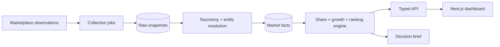

# MarketWatch — e-commerce category intelligence

[](https://github.com/juanlopolicaarpio/marketwatch-intelligence/actions/workflows/ci.yml)

MarketWatch turns fragmented marketplace observations into a structured view of category size, market share, platform distribution, brand momentum, and product leadership.

> **Public release:** this system is based on market-intelligence software I built for real commercial analysis. Company identities, product records, marketplace observations, database identifiers, and metrics have been replaced with fictional and synthetic equivalents. No production collector or customer database is connected.

## What it demonstrates

- A complete product surface: positioning site, interactive analytics dashboard, and typed API.
- Market-share, platform-mix, growth, product-ranking, and category-trend analysis.
- A decision brief that turns observations into explicit commercial actions.
- Filterable API contracts designed for category, subcategory, period, and platform dimensions.
- A clear boundary between collection, normalization, analytics, and presentation.
- A zero-credential synthetic runtime suitable for direct technical review.

## System view



The public release begins at the normalized synthetic-data boundary. It demonstrates the downstream product and analysis contracts without publishing proprietary source lists, collection tactics, customer taxonomies, or business data.

Read [the architecture notes](docs/ARCHITECTURE.md) and [data-pipeline design](docs/DATA_PIPELINE.md).

## Run locally

```bash
npm ci
npm run dev
```

- Product page: `http://localhost:3000`
- Interactive dashboard: `http://localhost:3000/dashboard`
- API: `http://localhost:3000/api/market/overview`

No account, database, or environment variable is required.

## API example

```bash
curl "http://localhost:3000/api/market/overview?category=Personal%20Care&platform=Shopee"
```

The response includes the selected scope, market totals, brand share, platform mix, trend series, ranked products, and a synthetic-data disclosure.

## Quality gates

```bash
npm run lint
npm run typecheck
npm run build
# or all three
npm run check
```

## Repository map

```text
app/page.tsx                   product and methodology surface
app/dashboard/page.tsx         interactive category dashboard
app/api/market/overview/       typed filterable API
lib/market-data.ts             synthetic normalized market dataset
docs/                          architecture and pipeline decisions
```

## Confidentiality

The public release excludes real companies, customers, marketplace accounts, session material, collectors, source HTML, exports, credentials, database snapshots, and proprietary taxonomy mappings.

## Author

Built by [Juanlo Policarpio](https://github.com/juanlopolicaarpio).

Copyright © 2026 Juanlo Policarpio. All rights reserved. See [LICENSE](LICENSE).
