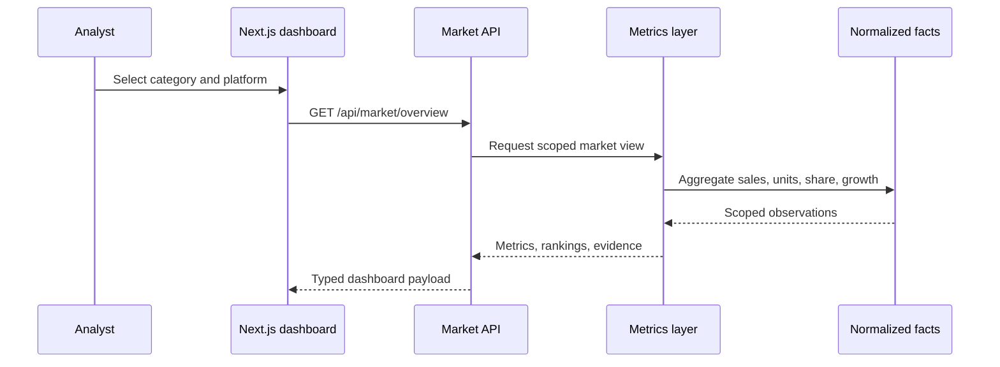

# Architecture

## Product boundary

MarketWatch separates acquisition from analysis. Collection jobs observe marketplace pages and feeds; normalization maps those observations to stable brand, product, category, platform, and time dimensions. The dashboard consumes facts and computed metrics rather than scraper output.

That separation matters because collectors change frequently while the analytical contract should remain stable.

## Application flow

## Engineering decisions

### Stable facts before dashboards

Source-specific fields are normalized before they reach product code. This prevents page markup or provider terminology from leaking into analytics components.

### Share has an explicit denominator

Market share is always calculated against the tracked category, period, and platform scope returned with the response. The UI does not imply coverage beyond the observations in that scope.

### Decision support, not decorative charts

The dashboard pairs each view with a commercial question: where share moved, which platform drove the change, which products explain it, and what should be investigated next.

### Public-data boundary

The public runtime begins with a synthetic normalized dataset. Collection code, source lists, raw captures, and customer-specific mappings are deliberately outside the release.
